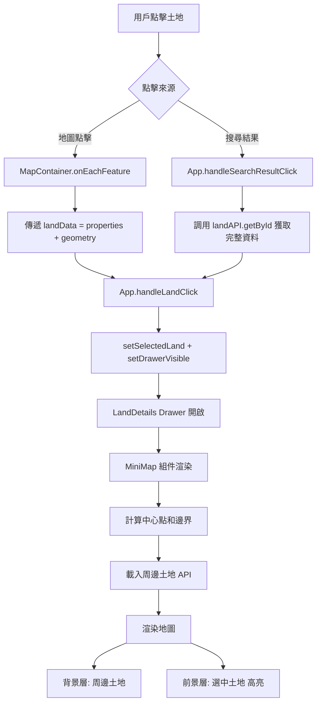

# 迷你地圖功能說明

## 🗺️ 功能概述

在土地詳細資訊側邊欄（Drawer）中新增迷你地圖，讓用戶在查看土地詳情時也能看到：
- ✅ 選中土地的地理位置（高亮顯示）
- ✅ 周邊鄰近宗地（淡化顯示）
- ✅ 互動式地圖（可拖曳、縮放）

---

## 📸 使用場景

### 問題
當用戶點擊土地（地圖或搜尋結果）後：
- 右側 Drawer 顯示詳細資訊 ✅
- 主畫面被遮罩模糊化 ⚠️
- **看不到土地的地理位置和周邊環境** ❌

### 解決方案
在 Drawer 頂部加入**迷你地圖**：
```
┌─────────────────────────────┐
│   [迷你地圖]                │
│   - 選中土地（琥珀色高亮）   │
│   - 周邊宗地（藍色淡化）     │
│   - 可拖曳、縮放            │
├─────────────────────────────┤
│   位置資訊                  │
│   土地資訊                  │
│   價值資訊                  │
│   所有權資訊                │
└─────────────────────────────┘
```

---

## 🎨 視覺設計

### 配色方案

| 元素 | 顏色 | 說明 |
|------|------|------|
| **選中宗地填充** | #F59E0B (琥珀色) | 60% 不透明度，醒目突出 |
| **選中宗地邊框** | #D97706 (深琥珀色) | 3px 寬，清晰邊界 |
| **周邊宗地填充** | #0369A1 (藍色) | 20% 不透明度，背景襯托 |
| **周邊宗地邊框** | #0F172A (深藍) | 1px 寬，50% 不透明度 |

### 尺寸規格

- **地圖高度**: 280px
- **Drawer 寬度**: 520px (從 450px 增加)
- **邊框**: 2px 實線邊框 + 中等陰影
- **圓角**: 8px (var(--radius-md))

### 圖例

右下角顯示圖例：
```
┌──────────────┐
│ █ 選中宗地   │ (琥珀色)
│ ░ 鄰近宗地   │ (藍色淡化)
└──────────────┘
```

---

## 🔧 技術實作

### 新增檔案

**`src/components/Map/MiniMap.jsx`** (270 行)
- 迷你地圖組件
- 自動計算地圖中心點和邊界
- 載入周邊土地資料（100 筆限制）
- 雙層 GeoJSON 渲染（背景 + 前景）

### 修改檔案

1. **`src/components/Sidebar/LandDetails.jsx`**
   - 導入 MiniMap 組件
   - 在 Drawer 頂部渲染地圖
   - 調整 Drawer 寬度 (450px → 520px)

2. **`src/components/Map/MapContainer.jsx`**
   - 修改 `onEachFeature` 點擊處理
   - 傳遞完整 feature（包含 geometry）而非只有 properties

---

## 💡 核心邏輯

### 1. 計算地圖設定

```javascript
const mapSettings = useMemo(() => {
  // 解析 GeoJSON Polygon 座標
  const coords = land.geometry.coordinates[0];

  // 計算邊界
  const minLng = Math.min(...coords.map(c => c[0]));
  const maxLng = Math.max(...coords.map(c => c[0]));
  const minLat = Math.min(...coords.map(c => c[1]));
  const maxLat = Math.max(...coords.map(c => c[1]));

  // 計算中心點
  const centerLng = (minLng + maxLng) / 2;
  const centerLat = (minLat + maxLat) / 2;

  // 擴展邊界 150% 以顯示周邊區域
  const lngPadding = (maxLng - minLng) * 1.5;
  const latPadding = (maxLat - minLat) * 1.5;

  return {
    center: [centerLat, centerLng],
    zoom: 16,
    bounds: expandedBounds
  };
}, [land]);
```

### 2. 載入周邊土地

```javascript
useEffect(() => {
  const loadNearbyLands = async () => {
    const { minLng, minLat, maxLng, maxLat } = mapSettings.bounds;

    // 使用 bbox API 載入周邊土地（限制 100 筆）
    const geoJson = await landAPI.getByBbox(
      minLng, minLat, maxLng, maxLat, 100
    );

    // 過濾掉當前選中的土地（避免重複顯示）
    geoJson.features = geoJson.features.filter(
      feature => feature.properties.id !== land.id
    );

    setNearbyLands(geoJson);
  };

  loadNearbyLands();
}, [mapSettings.bounds, land.id]);
```

### 3. 雙層渲染

```jsx
<MapContainer center={center} zoom={zoom}>
  {/* 背景層：周邊土地（淡化） */}
  <GeoJSON data={nearbyLands} style={nearbyLandStyle} />

  {/* 前景層：選中土地（高亮） */}
  <GeoJSON data={selectedLand} style={selectedLandStyle} />
</MapContainer>
```

---

## 🎯 互動功能

### 地圖操作

| 操作 | 功能 |
|------|------|
| **拖曳** | 移動地圖查看更大範圍 |
| **滾輪縮放** | 禁用（防止意外縮放） |
| **雙擊縮放** | 啟用 |
| **縮放按鈕** | 顯示在左上角 |

### Tooltip 提示

- **Hover**: 顯示土地地號和位置
- **格式**: `台北市 中正區<br/>博愛段一小段 17-1`

### Popup 彈出框

點擊**選中的土地** polygon 顯示：
```
選中的土地
台北市 中正區
博愛段一小段 17-1
面積: 1234.56 m²
```

---

## 📊 效能優化

### 資料限制

- **周邊土地**: 最多 100 筆（避免過載）
- **API 調用**: 每次開啟 Drawer 調用 1 次
- **快取**: 無（每次重新載入以確保即時性）

### 載入狀態

```jsx
{loading && (
  <span style={{ fontSize: '0.75rem', color: 'var(--color-text-muted)' }}>
    載入周邊資料...
  </span>
)}
```

### 錯誤處理

- 無 geometry: 顯示「無地理資訊」占位符
- API 失敗: 靜默失敗（只顯示選中土地，不顯示周邊）
- 計算錯誤: 回退到台灣中心點 (23.5, 121) zoom 8

---

## 🔄 資料流程



---

## 🎨 CSS 樣式類別

### 新增樣式

無需新增 CSS 類別，全部使用內聯樣式和 CSS 變數：

```javascript
style={{
  height: '280px',
  borderRadius: 'var(--radius-md)',
  border: '2px solid var(--color-border)',
  boxShadow: 'var(--shadow-md)'
}}
```

### 使用的 CSS 變數

- `var(--color-accent)` - 藍色強調色
- `var(--color-border)` - 邊框顏色
- `var(--color-primary)` - 主色（深藍）
- `var(--color-text)` - 文字顏色
- `var(--color-text-muted)` - 次要文字
- `var(--color-hover)` - Hover 背景
- `var(--radius-md)` - 中等圓角
- `var(--shadow-md)` - 中等陰影
- `var(--space-sm/md)` - 間距

---

## 📱 響應式設計

### Desktop (> 768px)
- Drawer 寬度: 520px
- 地圖高度: 280px
- 完整功能

### Tablet/Mobile (< 768px)
- Drawer 寬度: 100%（Ant Design 預設）
- 地圖高度: 280px（保持不變）
- 禁用滾輪縮放（防止衝突）

---

## 🚀 未來擴充

### 短期
1. **周邊土地互動**
   - 點擊周邊土地也能查看詳情
   - 需要實作巢狀 Drawer 或 Modal

2. **自訂視野範圍**
   - 添加按鈕調整擴展倍數（1x, 1.5x, 2x）
   - 用戶控制顯示範圍大小

3. **衛星圖層切換**
   - 添加圖層切換按鈕
   - OpenStreetMap ↔ Satellite View

### 中期
4. **測量工具**
   - 測量與選中土地的距離
   - 顯示周邊 500m 範圍圈

5. **3D 視角**
   - 使用 Mapbox GL JS
   - 顯示建物高度

### 長期
6. **街景整合**
   - Google Street View 連結
   - 顯示最近的街景點

---

## 🐛 已知限制

1. **周邊土地數量限制**: 最多 100 筆
   - 在密集區域可能無法顯示全部
   - 解決：未來可添加「載入更多」按鈕

2. **無快取機制**: 每次開啟 Drawer 都會重新載入
   - 優點：資料即時
   - 缺點：增加 API 請求數
   - 解決：可添加 5 分鐘快取

3. **滾輪縮放禁用**: 避免意外操作
   - 用戶可能不習慣
   - 解決：可添加設定開關

---

## 📝 維護指南

### 調整地圖高度

修改 `MiniMap.jsx` 第 193 行：
```javascript
height: '280px', // 改成你想要的高度
```

### 調整擴展範圍

修改 `MiniMap.jsx` 第 41-42 行：
```javascript
const lngPadding = (maxLng - minLng) * 1.5; // 1.5 改為 2.0 擴展更大範圍
const latPadding = (maxLat - minLat) * 1.5;
```

### 調整周邊土地數量

修改 `MiniMap.jsx` 第 77 行：
```javascript
const geoJson = await landAPI.getByBbox(minLng, minLat, maxLng, maxLat, 100); // 改成 200
```

### 修改配色

修改 `MiniMap.jsx` 第 95-107 行：
```javascript
const selectedLandStyle = {
  fillColor: '#F59E0B',     // 改成你想要的顏色
  weight: 3,
  opacity: 1,
  color: '#D97706',
  fillOpacity: 0.6
};
```

---

## 🔗 相關檔案

### 新增
- `src/components/Map/MiniMap.jsx` - 迷你地圖組件（270 行）

### 修改
- `src/components/Sidebar/LandDetails.jsx` - 整合迷你地圖
- `src/components/Map/MapContainer.jsx` - 傳遞 geometry 資料

### 依賴
- `react-leaflet` - 地圖渲染
- `leaflet` - 地圖核心
- `antd` - UI 組件
- `src/services/api.js` - API 調用

---

**最後更新**: 2026-01-22
**功能版本**: 1.0.0
**作者**: Claude + User Collaboration
